# Dev Track

This project is designed using Django to track the engineering issues.
Basic setup consists of two entities namely Reporter and Issue, where a reporter can be report any issues that can be characterised based on priority, status etc.

## How to run

---
# Open terminal

1. Create a virtual environment
python3 -m venv .venv

2. Activate the environment
source .venv/bin/activate

3. Install django and djangorestframework
pip install django

pip install djangorestframework

4. Initiate server
python manage.py runserver

# Once server is activated, use below endpoints to interact.

5. Once done - press ctrl + c, to shut down the server

6. Deactivate the environment
enter "deactivate" in terminal and press enter

---

## Endpoints USAGE

# ************ REPORTER *********** 

---

# 1. api/reporters/

Used to get reporters list. Will return empty array in case no reporters created yet.

When data available:
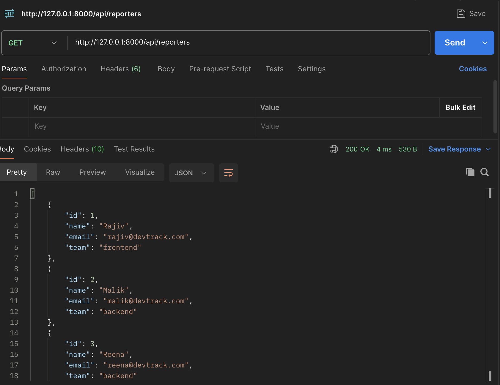

---

# 2. api/reporters/{reporter-id}

Used to get details for specific reporter. The api accepts the reporter id, for which data would be returned in response if found.

When reporter data is found:
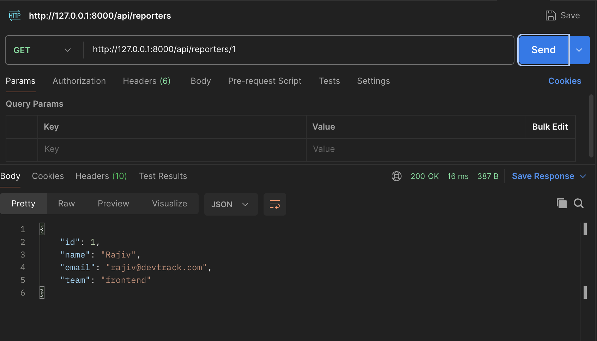

When reporter data not available:
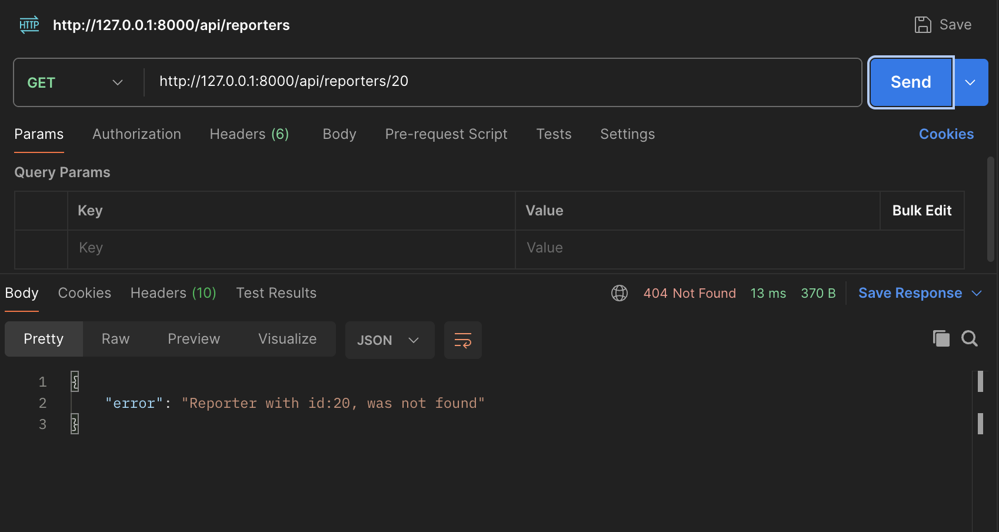

---

# 3. api/reporters/create/

A post API used to create new reporter.
The API accepts 3 param "name", "email" and "team" info. Name and Email are mandatory info to be provided in order to create new reporter.
Also additional checks are made to keep name and email id unique for new reporter.

new reporter success
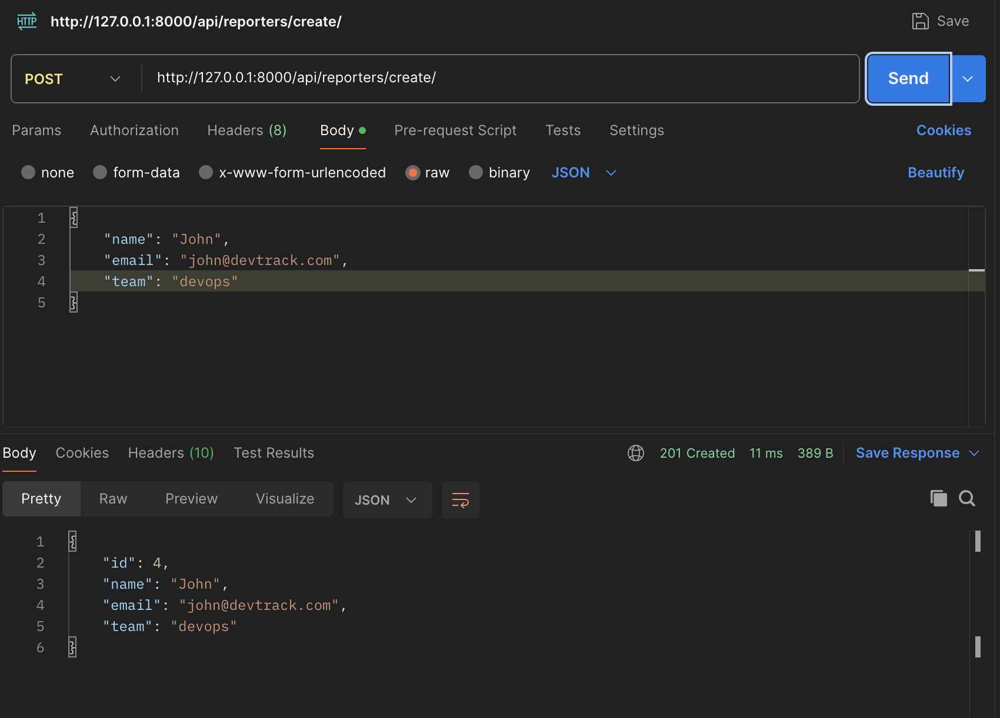

new reporter duplicate
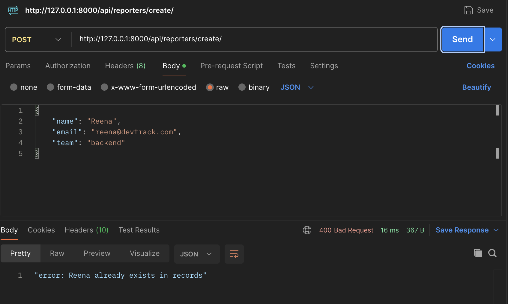

new reporter mandatory check
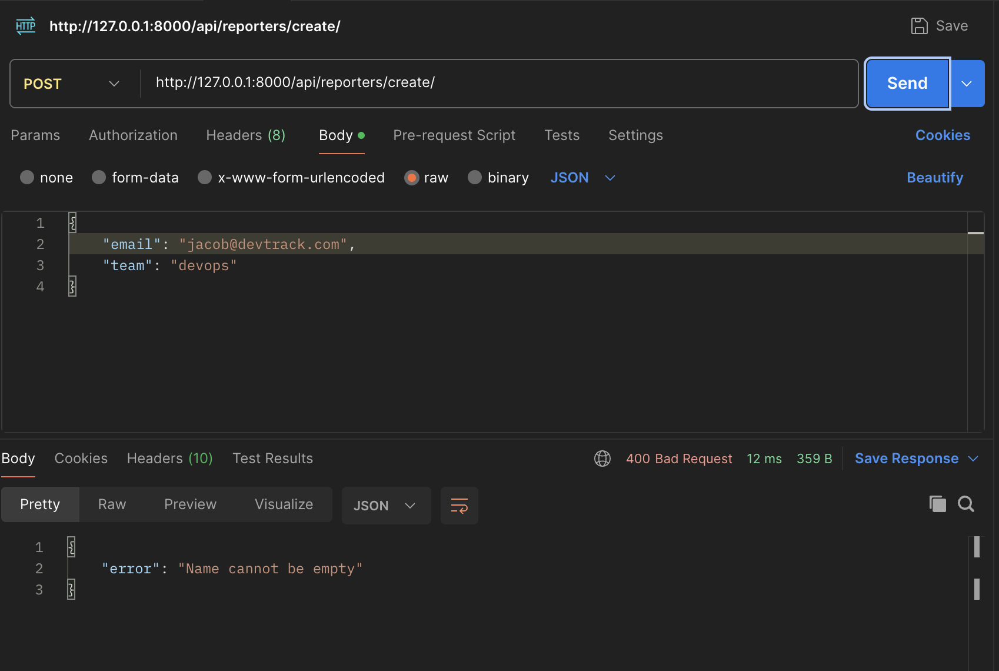

---

# ************ ISSUES ***********

---
# 1. api/issues/

Used to get list of all reported issues.
Api also accepts query params namely "id" that will repond with issue if found against provided id and "status" that can be used to get issues list againt provided status value.

Issues list fetch
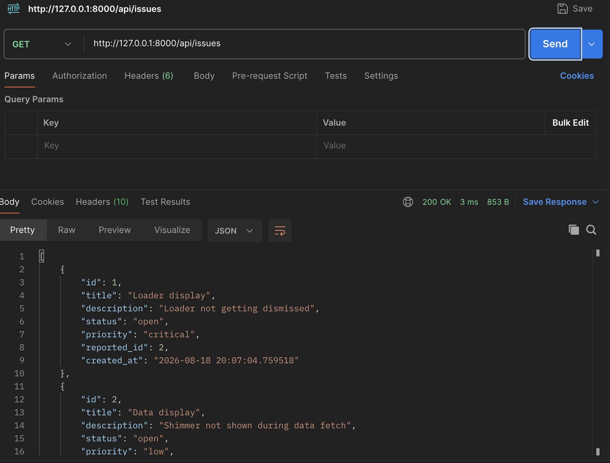

Issue by id
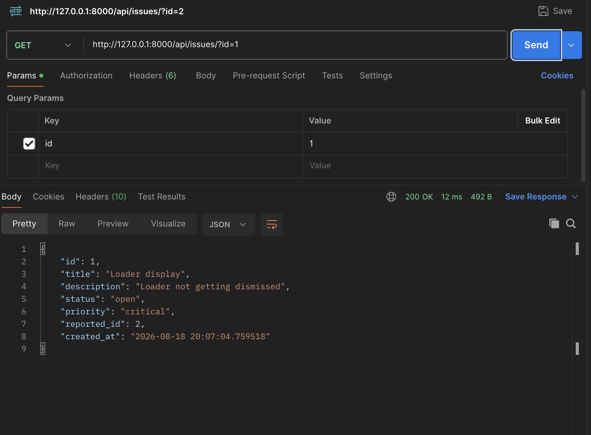

Issues list by status
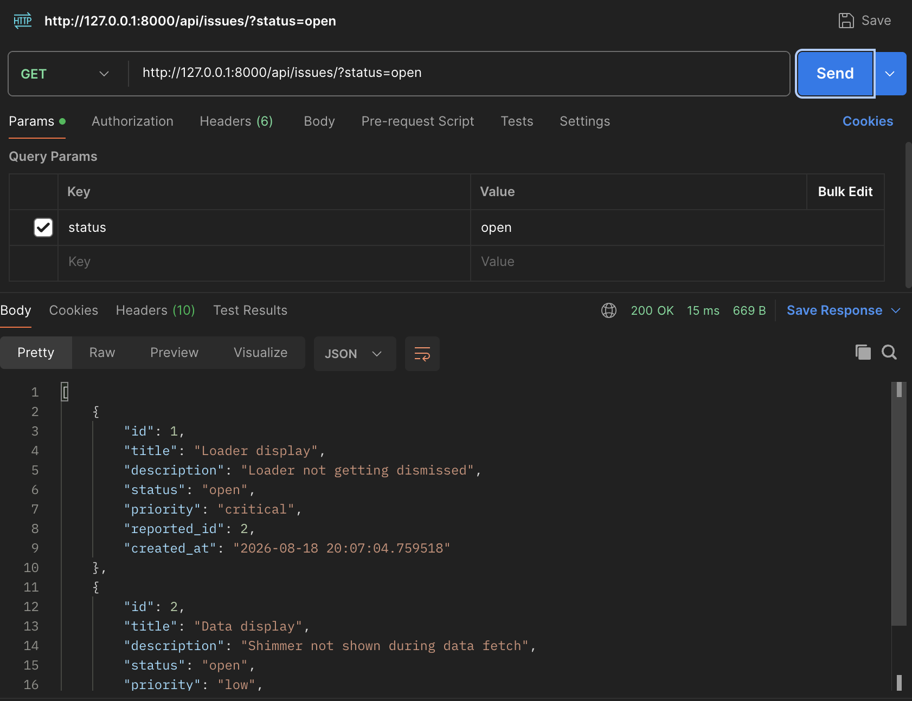

---

# 2. api/issues/create

A post api call to log new issue.
Api accepts multiple body params like title, description, status, priority and reporter id.
Title is mandatory for logging new issue.
Also, status or priority needs to be provided to pass mandatory checks.

New issue logged
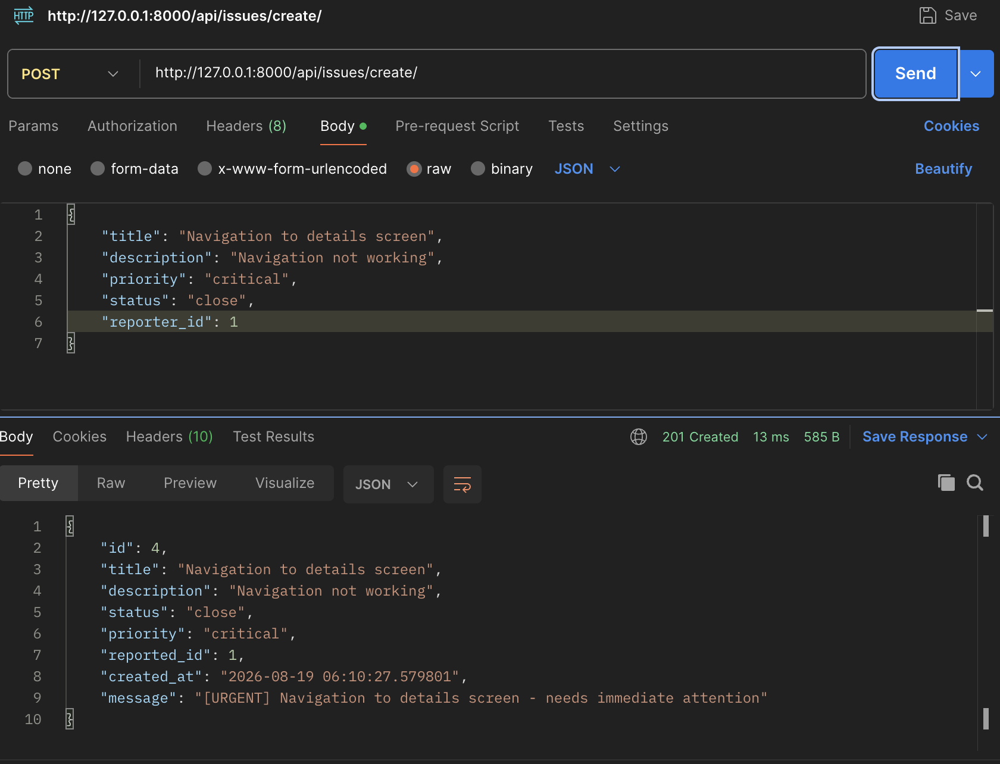

New issue mandatory check
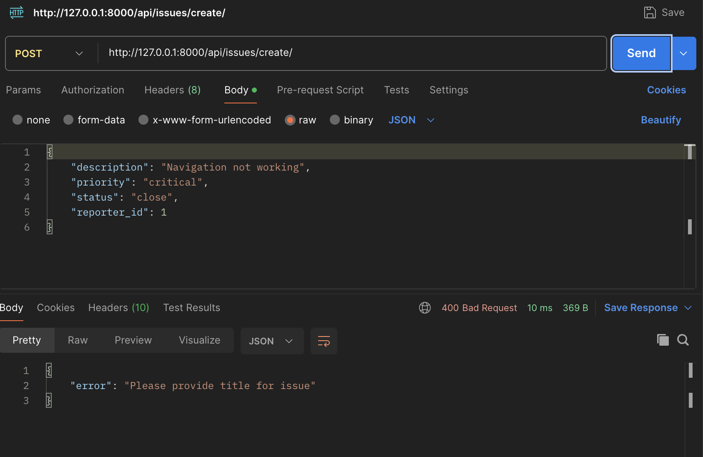